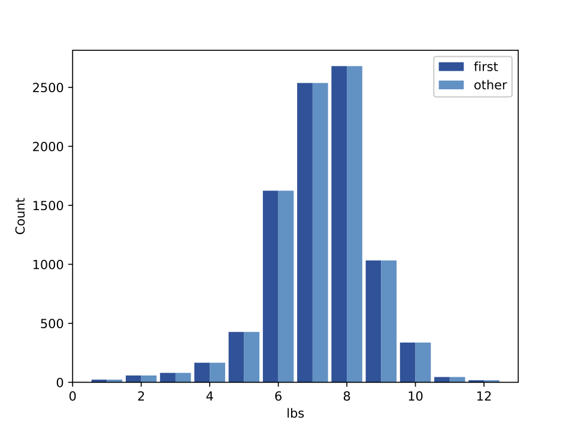

[Think Stats Chapter 2 Exercise 4](http://greenteapress.com/thinkstats2/html/thinkstats2003.html#toc24) (Cohen's d)
Using the variable `totalwgt_lb`, investigate whether first babies are lighter or heavier than others. Compute Cohen’s effect size to quantify the difference between the groups. How does it compare to the difference in pregnancy length?

>> The following are the descriptive statistics I computed in this python file [2-4cohens_d.py](https://github.com/lhow0901/dsp/edit/master/statistics/2-4-cohens_d.py)  
>>
>> First babies n =  4413  
>> Other babies n =  4735  
>> 
>> First babies mean =  7.2  lbs  
>> Other babies mean =  7.33  lbs  
>> 
>> First babies sd =  1.42  
>> Other babies sd =  1.39  
>>
>> Cohen's *d* for firsts vs others =  -0.09  
>>   
>>
>>Although the means show that first babies tend to weigh slightly less than other babies, the Cohen's *d*  value tells us that the effect size is very small. Any absolute value under .2 is considered very small.  
>>
>>For practical purposes, pregnant women would not experience any meaningful difference in the weight of their first babies compared with later ones.
