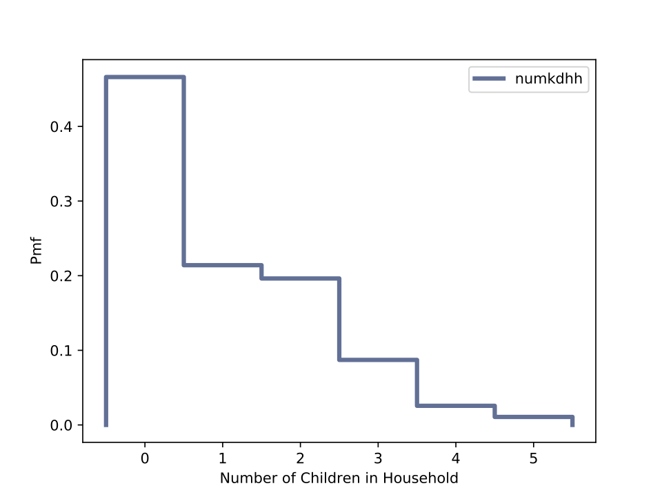
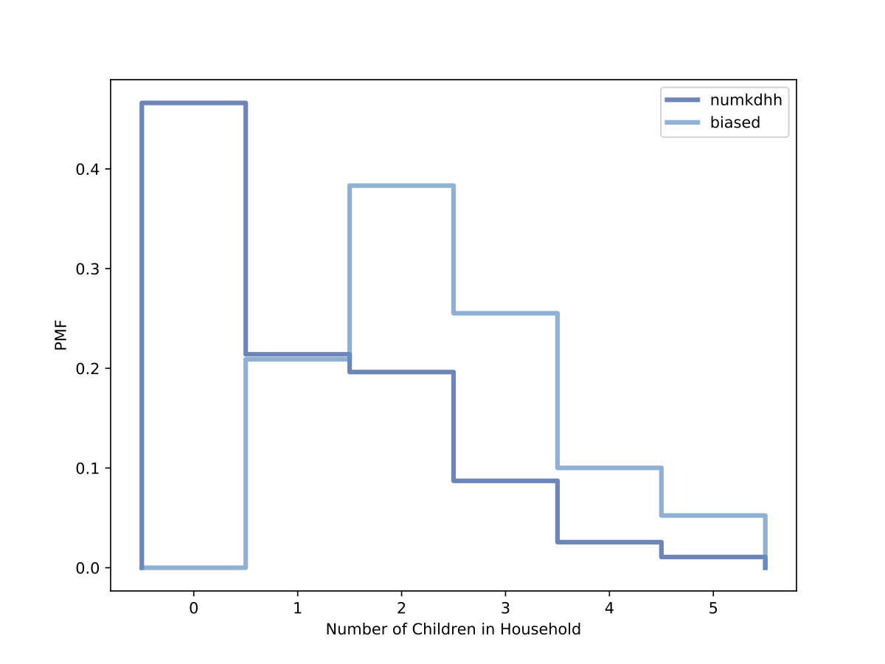

[Think Stats Chapter 3 Exercise 1](http://greenteapress.com/thinkstats2/html/thinkstats2004.html#toc31) (actual vs. biased)
Use the NSFG respondent variable numkdhh to construct the actual distribution for the number of children under 18 in the respondents' households. Now compute the biased distribution we would see if we surveyed the children and asked them how many children under 18 (including themselves) are in their household. Plot the actual and biased distributions, and compute their means.

>> Below is a histogram of the actual distribution for the number of children under 18 in the household for the 2002 female respondent data set.  

  

>>Below is a histogram comparing the actual distribution versus the biased distribution if we surveyed the children and asked them how many children under 18 (including themselves) are in their household.  

>> unbiased mean = 1.02420515504  
>> biased mean = 2.40367910066
