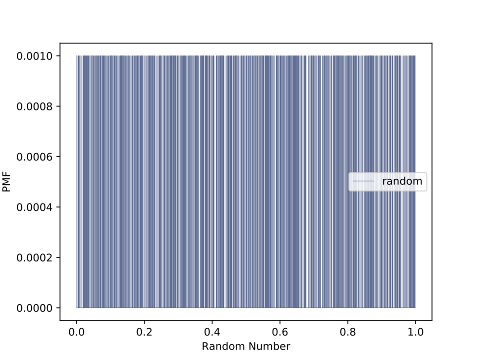
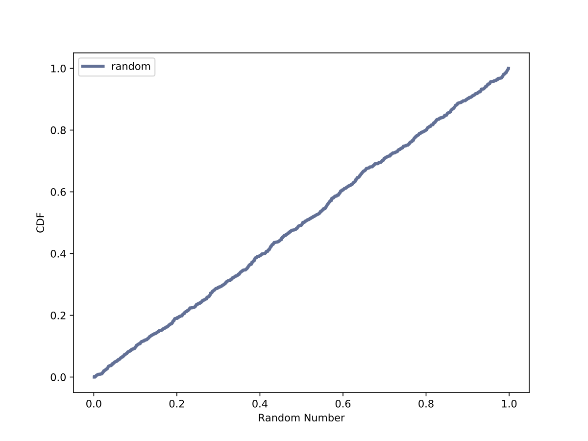

[Think Stats Chapter 4 Exercise 2](http://greenteapress.com/thinkstats2/html/thinkstats2005.html#toc41) (a random distribution)  

The numbers generated by numpy.random.random are supposed to be uniform between 0 and 1; that is, every value in the range should have the same probability. Generate 1000 numbers from `numpy.random.random` and plot their PMF. What goes wrong? Now plot the CDF. Is the distribution uniform?  
>> All of the below plots were created using my python file found here [4-2-random_dist.py](https://github.com/lhow0901/dsp/blob/master/statistics/4-2-random_dist.py).  
>> Below is my PMF plot of 1000 randomly generated numbers between 0 and 1. Each number is equally likely to have occurred since they are random numbers. This plot makes it difficult to see that the dstribution is uniform.  

  

>>Below is my CDF plot of the same 1000 randomly generated numbers between 0 and 1. This plot makes it much easier to see the uniform distribution  

